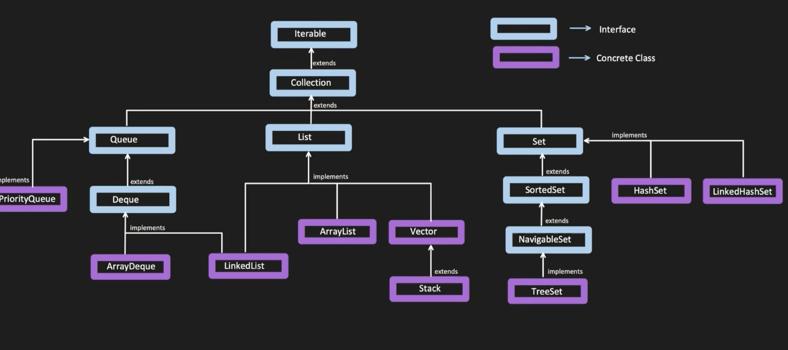

# Java Collections Framework

## Collection
    Collection in java is a framework that provides an architecture to store and manipulate the group of objects.
    It's an interface that represents a group of objects known as its elements. 
    Java Collection framework provides many interfaces (Set, List, Queue, Deque) 
    and classes (ArrayList, Vector, LinkedList, PriorityQueue, HashSet, LinkedHashSet, TreeSet).

## Iterable
The Iterable interface is the root interface for all the collection classes.
The Collection interface extends the Iterable interface and therefore all the subclasses of Collection interface also implement the Iterable interface.
when we use a for-each loop to iterate over a collection, internally it uses the iterator() method of the Iterable interface.

## Collection
Collection is an interface available in java.util package and extends Iterable interface.
It is the root interface in the collection hierarchy.
It represents a group of objects known as its elements.
Methods:
- add(E e) - Ensures that this collection contains the specified element
- remove(Object o) - Removes a single instance of the specified element from this collection, if it is present
- contains(Object o) - Returns true if this collection contains the specified element
- size() - Returns the number of elements in this collection
- isEmpty() - Returns true if this collection contains no elements
- clear() - Removes all the elements from this collection
- iterator() - Returns an iterator over the elements in this collection
- forEach(Consumer<? super E> action) - Performs the given action for each element of the Iterable until all elements have been processed or the action throws an exception

## Queue
Queue is an interface available in java.util package and extends Collection interface.
It represents a data structure designed to have elements inserted at the end of the queue, and elements removed from the beginning of the queue.
Methods:
- add() - Inserts the specified element into this queue and throws an exception if the element cannot be inserted
- offer() - Inserts the specified element into this queue, returns true if the element was added to this queue and false otherwise
- remove() - Retrieves and removes the head of this queue and throws an exception if this queue is empty
- poll() - Retrieves and removes the head of this queue and returns null if this queue is empty
- element() - Retrieves, but does not remove, the head of this queue and throws an exception if this queue is empty

### PriorityQueue
PriorityQueue is an unbounded queue based on a priority heap and the elements of the priority queue are ordered according to the natural ordering, 
or by a Comparator provided at queue construction time, depending on which constructor is used.

### Deque
Deque is a linear collection that supports element insertion and removal at both ends.
The Deque interface is a subtype of the Queue interface.
Methods:
- addFirst() - Inserts the specified element at the front of this deque
- addLast() - Inserts the specified element at the end of this deque
- offerFirst() - Inserts the specified element at the front of this deque
- offerLast() - Inserts the specified element at the end of this deque
- removeFirst() - Retrieves and removes the first element of this deque
- removeLast() - Retrieves and removes the last element of this deque
- pollFirst() - Retrieves and removes the first element of this deque
- pollLast() - Retrieves and removes the last element of this deque
- getFirst() - Retrieves, but does not remove, the first element of this deque
- getLast() - Retrieves, but does not remove, the last element of this deque
- peekFirst() - Retrieves, but does not remove, the first element of this deque
- peekLast() - Retrieves, but does not remove, the last element of this deque
- removeFirstOccurrence(Object o) - Removes the first occurrence of the specified element from this deque
- push() - Pushes an element in the front of the deque
- pop() - Pops an element from the front of the deque

#### Comparator and Comparable
Comparator and Comparable are interfaces in Java that are used to sort the objects of user-defined classes.
Comparator interface is used to order the objects of a user-defined class.
Comparable interface is used to order the objects of a user-defined class.

## List
List is an interface available in java.util package and extends Collection interface.
It is an ordered collection that allows us to store the duplicate elements.
List interface is implemented by ArrayList, LinkedList, Vector, and Stack classes.
methods available in List interface:
- add(int index, E element) - Inserts the specified element at the specified position in this list
- remove(int index) - Removes the element at the specified position in this list
- get(int index) - Returns the element at the specified position in this list
- set(int index, E element) - Replaces the element at the specified position in this list with the specified element
- indexOf(Object o) - Returns the index of the first occurrence of the specified element in this list, or -1 if this list does not contain the element
- lastIndexOf(Object o) - Returns the index of the last occurrence of the specified element in this list, or -1 if this list does not contain the element
- listIterator() - Returns a list iterator over the elements in this list (in proper sequence)
- listIterator(int index) - Returns a list iterator over the elements in this list (in proper sequence), starting at the specified position in this list
- subList(int fromIndex, int toIndex) - Returns a view of the portion of this list between the specified fromIndex, inclusive, and toIndex, exclusive
- sort(Comparator<? super E> c) - Sorts this list according to the order induced by the specified Comparator
- replaceAll(UnaryOperator<E> operator) - Replaces each element of this list with the result of applying the operator to that element
- removeIf(Predicate<? super E> filter) - Removes all of the elements of this collection that satisfy the given predicate

### ArrayList
ArrayList is a resizable array implementation of the List interface.
It is faster than the LinkedList because it uses a dynamic array to store the elements.
It maintains the insertion order and allows duplicate elements

### Vector
Vector is similar to an ArrayList, but it is thread-safe.

### Stack
Stack is a subclass of Vector that implements a standard last-in, first-out stack.
its also thread-safe.

## Map
Map is an interface available in java.util package.
methods:
- put(K key, V value) - puts the specified value with the specified key in this map, if the map already contains a mapping for the key, the old value is replaced
- size() - Returns the number of key-value mappings in this map
- get(Object key) - Returns the value to which the specified key is mapped, or null if this map contains no mapping for the key
- remove(Object key) - Removes the mapping for the specified key from this map if present
- containsKey(Object key) - Returns true if this map contains a mapping for the specified key
- containsValue(Object value) - Returns true if this map maps one or more keys to the specified value
- keySet() - Returns a Set view of the keys contained in this map
- values() - Returns a Collection view of the values contained in this map
- entrySet() - Returns a Set view of the mappings contained in this map
- clear() - Removes all the mappings from this map
- putIfAbsent(K key, V value) - If the specified key is not already associated with a value (or is mapped to null) associates it with the given value and returns null, else returns the current value
- 

