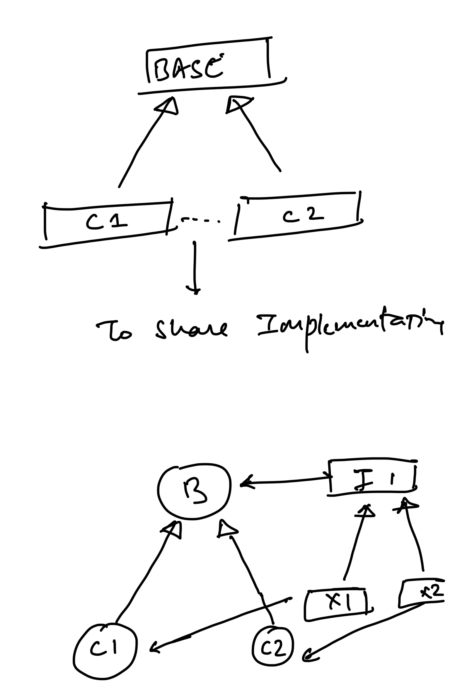

# Design Patterns

### Strategy Design Pattern
this pattern is used to share implementations between child classes of base class.

https://refactoring.guru/design-patterns/strategy

### Observer Design Pattern
this pattern is used to notify all observers when a change happens in the subject.

### Decorator Design Pattern
this pattern is used to add new functionality to an existing object without altering its structure.
