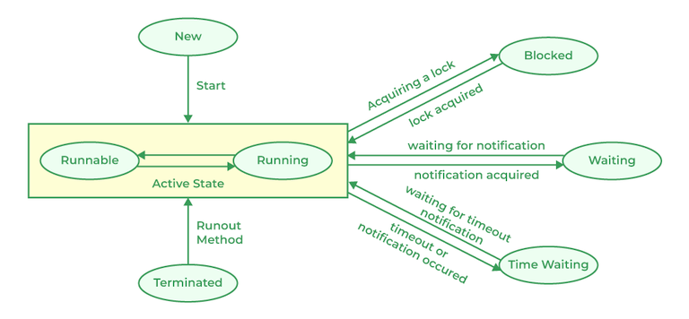

# Multithreading
multithreading is a way to run multiple threads concurrently. It is a way to achieve multitasking.

## Types of threads
- User threads: created by the application
- Daemon threads: created by the JVM
note: While a user thread is running, the JVM will not exit. However, if only daemon threads are running, the JVM will exit.

## Synchonization
Threads share the same memory space, so they can access the same data. 
There are two ways to synchronize threads:
### Synchronized methods
```java
public synchronized void method() { // the lock is on the class instance
    // code
}
public static synchronized void method() { // the lock is on the class
    // code
}
```
### Synchronized blocks
```java
public void method() {
    // code
    synchronized (lock) { // lock is an object
        // code
    }
}
```

### Volatile keyword
The volatile keyword is used to declare a variable as a volatile variable. 
This means that the variable is always read from and written to the main memory, and not from the CPU cache. 
This is useful when multiple threads are accessing the same variable.

### Wait and notify
The wait() and notify() methods are used to communicate between threads.
The wait() method is used to make a thread wait until another thread calls the notify() method.
When the thead is waiting, it releases the lock on the object and goes to sleep. It starts execution from the point where it went to sleep when it is notified.
The notify() method is used to wake up a thread that is waiting for another thread to finish.


## Thread states

A thread can be in one of the following states:
- New: the thread is created but not started
- Runnable: the thread is ready to run
- Running: the thread is running
- Blocked: the thread is waiting for a lock
- Waiting: the thread is waiting for another thread to finish


## Thread priorities
- MIN_PRIORITY: 1
- NORM_PRIORITY: 5
- MAX_PRIORITY: 10
Thread priorities are used to determine the order in which threads are executed.
child threads inherit the priority of the parent thread.

## Thread Scheduling
The JVM uses the following scheduling algorithms:
- Preemptive scheduling: the highest priority thread is executed
- Time slicing: each thread is given a time slice to execute
- Round-robin scheduling: each thread is given a time slice to execute, and the thread that is not finished is put at the end of the queue

## Deadlocks
This occurs when two or more threads are waiting for each other to release the lock on an object, and none of them releases the lock.
To prevent deadlocks, we can use the following methods:
- Avoid nested locks
- Use a timeout
- Locks should be acquired in the same order